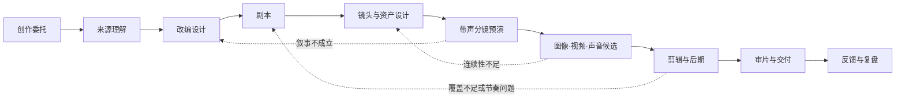
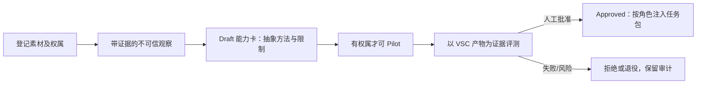

# VSC · Video Short Create

VSC 是一个独立的短剧／短视频创作工作流。它把小说、原创故事、品牌资料或外部交接包，组织为可追溯的：**改编 → 剧本 → 镜头与资产 → 预演 → 图像/视频/声音候选 → 剪辑 → 审片与交付**。

当前版本：**v0.3**。已实现总编排器、专业角色、可扩展 Profile、项目状态机、质量门、Vendor 治理，以及受控的角色记忆、任务上下文与能力学习闭环；尚未接入任何真实的图像、图生视频、声音或剪辑供应商，也不会自动训练模型。

VSC 不嵌入、不调用其他插件。任何外部系统都只能作为文件来源，或提供标准 `creative-handoff/v1` 交接包；VSC 对导入后的创作与制作负责。

## 为什么存在

短剧制作不应等同于“输入小说，连续调用几个生成模型”。真正需要被管理的是：

- 创作意图：为谁做、让观众看到什么、什么绝不能改；
- 来源依据：原文事实、人物说法、解释、改编、新增与待定不能混为一谈；
- 创作选择：剧本、表演、运镜、转场、音乐和最终 take 由明确责任人选择；
- 生产连续性：人物、场景、动作、声音和镜头参考必须跨镜、跨集可复用；
- 版本与返工：每份产物要有来源、依赖、批准状态与新鲜度；问题要退回最早的责任环节；
- 团队差异：不同工作室应能替换 Profile、角色、质量门和生成适配器，而不改写核心语义。
- 可持续复用：经过权属核验、试用和评测的创作方法应成为团队能力；来源素材、临时对话和未经验证的模型输出不能越过这个边界。

VSC 的基本立场是：**意图先于生成，产物先于任务，人对创作选择负责。**

## 两种入口

### 新手：只说需求

```text
/vsc 把一部都市悬疑小说改成 20 集竖屏短剧
/vsc 我只有“雨夜收到假信”的想法，想做一条 60 秒剧情短片
```

`/vsc` 会识别已有来源、受众、时长/画幅、目标、约束和责任人；信息不足时给出一项推荐和少量备选，每轮只收敛一个会影响后续工作的决定。它再选择 Profile，安排专业角色，并把产物与决定记录进项目状态。

### 熟手：直接打磨一个环节

| 目标 | 命令 | 主要工作 |
|---|---|---|
| 小说理解、改编契约、分集 | `/vsc-adapt` | 来源映射、故事底稿、改编与分集设计 |
| 场次、对白、节奏 | `/vsc-script` | 可表演、可拍摄、可听的剧本 |
| 镜头、运镜、转场、预演 | `/vsc-direct` | ShotPlan、视觉语法、Animatic |
| 人物、动作、声音、场景 | `/vsc-assets` | AssetBible、参考资产与连续性约束 |
| 图像、图生视频、音频候选 | `/vsc-produce` | 供应商中立的生成计划与 take 记录 |
| 剪辑、BGM、音效、字幕、审片 | `/vsc-post` | Timeline、Mix、审片与交付 |
| 从素材沉淀受控方法 | `/vsc-learn` | 观察、能力卡、试用、评测与晋升 |
| 本地开源 Skill/工具 | `/vsc-vendor` | 来源审核、固定版本和本地同步 |

熟手不会被迫重走访谈；VSC 只读取当前环节所需的已批准产物，并补足受影响的依赖。

## 生产主线



在 S6 中，图片、视频、声音都是候选 take，不会因为“生成成功”自动进入成片。带临时对白、音效和音乐节拍的 S5 预演，是在扩大生成成本前检验叙事、时长和镜头关系的关键点。

## 立即开始

VSC 的状态机只依赖 Python 标准库：

```bash
# 查看可选业务 Profile
python3 scripts/vsc_state.py profile list

# 新建一个小说连续短剧项目
python3 scripts/vsc_state.py init ./projects/雨夜来信 \
  --title "雨夜来信" \
  --profile vsc.novel-serial \
  --owner "导演"

# 查看下一关缺什么
python3 scripts/vsc_state.py status ./projects/雨夜来信
python3 scripts/vsc_state.py next ./projects/雨夜来信

# 登记小说或其他来源；脚本只记录路径与 SHA，不复制原文
python3 scripts/vsc_state.py source add ./projects/雨夜来信 \
  --kind novel --file ./source/雨夜来信.txt

# 将一份已完成的剧本登记为产物，并由负责人批准
python3 scripts/vsc_state.py artifact add ./projects/雨夜来信 \
  --type vsc.screenplay --stage script --file ./projects/雨夜来信/03-剧本/ep01-v1.md
python3 scripts/vsc_state.py artifact decide ./projects/雨夜来信 A-0001 \
  --status approved --by "导演"

# 检查某一阶段及其全部前置阶段是否具备已批准产物
python3 scripts/vsc_state.py gate check ./projects/雨夜来信 script
```

`vsc.json` 是项目的状态权威；正文、剧本、分镜、资产卡和媒体文件是版本化产物。脚本不会替你调用生成模型、支付费用、发布内容或替你作出创作批准。

## 角色记忆、上下文与学习能力

每个 VSC 角色都有固定的身份、工作人格、权限与记忆边界。例如故事分析师证据优先、导演避免无目的炫技、生成制作人严格区分候选与成片。它们是版本化角色定义，**不能**被素材、角色台词或当前对话自动重写。

子角色不接收主智能体的整段聊天记录，而接收一个最小、可审计的任务上下文包：已批准产物、项目/角色的已批准记忆、适用的已批准能力卡，以及只在本次任务存在的会话摘要。这样既能继承当前对话的关键决定，也避免将密钥、无关信息或提示注入传播给每个子角色。

```bash
# 先把人审过的项目经验登记为 draft，再批准
python3 scripts/vsc_state.py memory add ./projects/雨夜来信 \
  --scope role --role director --kind lesson --source A-0003 \
  --content "反转前先给观众一个可误读的视觉线索。"
python3 scripts/vsc_state.py memory decide ./projects/雨夜来信 M-0001 \
  --status approved --by "导演"

# 为子角色生成最小上下文；parent-brief 不写入长期状态
python3 scripts/vsc_state.py context build ./projects/雨夜来信 \
  --role director --task "编排第 1 集雨夜追逐" --artifact A-0003 \
  --parent-brief "用户确认节奏要紧张，但不使用血腥表现。"
```

“从视频、图片或文本学习武术、打斗、特效、布局、情绪、对白或声音”在 VSC 中是一个受控闭环，而非让系统照搬素材或自行训练：



```bash
# owned/licensed 才可能晋升；unknown / analysis_only 只能停留在研究观察
python3 scripts/vsc_state.py source add ./projects/雨夜来信 \
  --kind video --file ./references/动作样片.mp4 --rights owned
python3 scripts/vsc_state.py learn observe ./projects/雨夜来信 \
  --kind action --source S-0002 --file ./notes/动作五拍.md \
  --content "将起势、交手、受击、停顿、反转分成五拍，并检查方向线。"
python3 scripts/vsc_state.py capability propose ./projects/雨夜来信 \
  --name "五拍动作节奏" --kind action --observation O-0001 --role director \
  --method "按五拍拆镜头，为每拍标注方向线和情绪转折。" \
  --limits "仅用于有授权项目；不复制人物、声音、特定作品或受保护风格。"
python3 scripts/vsc_state.py capability decide ./projects/雨夜来信 C-0001 \
  --status pilot --by "导演"
```

能力卡只保存可复用的抽象方法、证据、适用角色和限制。它不会自动变成 LoRA/微调数据、声音克隆、人物复刻、供应商调用或商业授权；这类真实生产能力需要独立适配器、明确授权、预算与人工决策。

已有 v0.2 项目可保守迁移；已有来源会被标记为 `unknown`，直到负责人重新核验权属：

```bash
python3 scripts/vsc_state.py migrate ./projects/雨夜来信
```

## 可扩展 Profile

| Profile | 默认用途 | 重点质量门 |
|---|---|---|
| `vsc.narrative-base` | 原创剧情短片、一般叙事短视频 | 创作委托、来源理解、预演、时间线 |
| `vsc.novel-serial` | 小说改编连续短剧 | 改编契约、故事圣经、分集、声音方案、混音 |
| `vsc.brand-story` | 品牌叙事短视频 | 素材范围、产品主张映射、表达与用途审核 |

复制 `profiles/` 中的 JSON 即可开始为自己的团队定制阶段、必需产物与自动化策略。请保持 `vsc.*` 通用产物类型的语义稳定；团队独有字段使用自己的命名空间。

## 外部来源与插件边界

VSC 接受小说、原创文本、品牌资料、素材库或 `creative-handoff/v1` JSON 清单。交接包只包含来源身份、允许范围、版本化来源产物和既有决定；导入后仍要在 VSC 中重新形成并批准本项目的 StoryMap、改编方案、剧本和镜头资产。

这使来源工具与 VSC 保持独立：不会互相调用、不会共享内部状态、不会要求在同一目录安装。协议详情见 [外部来源与交接](skills/vsc/references/source-handoff.md)。

## 本地 Vendor：第三方 Skill/工具

经审核的开源 Skill 和辅助工具可放在本地 `vendor/`，但下载内容不提交到 Git。仓库只提交来源锁定文件、安装说明、许可证证据、用途和审批结论。

```bash
python3 scripts/vendor_sync.py --check  # 不联网、不下载
python3 scripts/vendor_sync.py --plan   # 不联网、不下载
python3 scripts/vendor_sync.py --sync   # 仅同步已批准、带许可证证据、固定到 40 位 commit 的来源
```

不提交第三方源码只能降低再次分发的风险，**不等于获得商业使用权**。许可证、NOTICE、模型权重、声音、图像、数据集、商标和平台条款仍须逐项确认。详见 [Vendor 治理](docs/07-vendor-governance.md) 与 [Vendor 安装说明](vendor/README.md)。

## 当前边界与路线

**已经实现**：总编排器与熟手命令、八类角色的身份/人格/权限边界、三种 Profile、项目状态机、来源交接协议、产物/依赖/审批/Gate、记忆审批、最小上下文包、受控能力卡与评测晋升、Vendor 治理、MIT 许可证和自动化自测。

**尚未实现**：真实图像/视频/语音供应商适配器、媒体存储、任务队列、成本账本、自动连续性检测、可视化时间线、真实观众实验与发布集成，以及真实模型训练/微调。它们必须在具体账户、地区、预算、数据/人格/声音授权和真实样片验证后接入，不应由架构文档假装完成。

下一阶段优先验证一条真实链路：一个 60 秒原创短片或一集小说短剧，从来源到带声预演，再到少量已批准镜头的图像/图生视频候选与人工审片。

## 文档与验证

| 文档 | 内容 |
|---|---|
| [01 思想基础与跨行业研究](docs/01-foundations-and-research.md) | 哲学、设计、影视、软件和系统工程的共性与边界 |
| [02 通用架构](docs/02-reference-architecture.md) | 产物、活动、决策、策略、版本、事件与可扩展内核 |
| [03 创作体系](docs/03-creative-production.md) | 从改编到镜头、资产、生成、后期和交付 |
| [04 Profile 与验证](docs/04-profiles-example-and-validation.md) | 业务定制、纸面样例和验证路线 |
| [05 来源与证据边界](docs/05-sources.md) | 公开研究资料与项目推论的边界 |
| [06 v0.2 升级方案](docs/06-vsc-v0.2-upgrade.md) | 架构如何落为插件骨架 |
| [07 Vendor 治理](docs/07-vendor-governance.md) | 本地开源 Skill/工具的审核、锁定和同步 |
| [08 记忆与能力学习](docs/08-memory-and-capability-learning.md) | 角色身份、任务上下文、素材观察、能力卡、评测与安全边界 |

```bash
python3 -B scripts/test_vsc_state.py
python3 -B scripts/test_vendor_sync.py
```

## 许可证

VSC 自身代码和文档采用 [MIT License](LICENSE)。`vendor/` 中第三方代码、Skill、工具、模型权重、素材或数据集不因 VSC 使用 MIT 而改变其各自许可证或使用限制。
