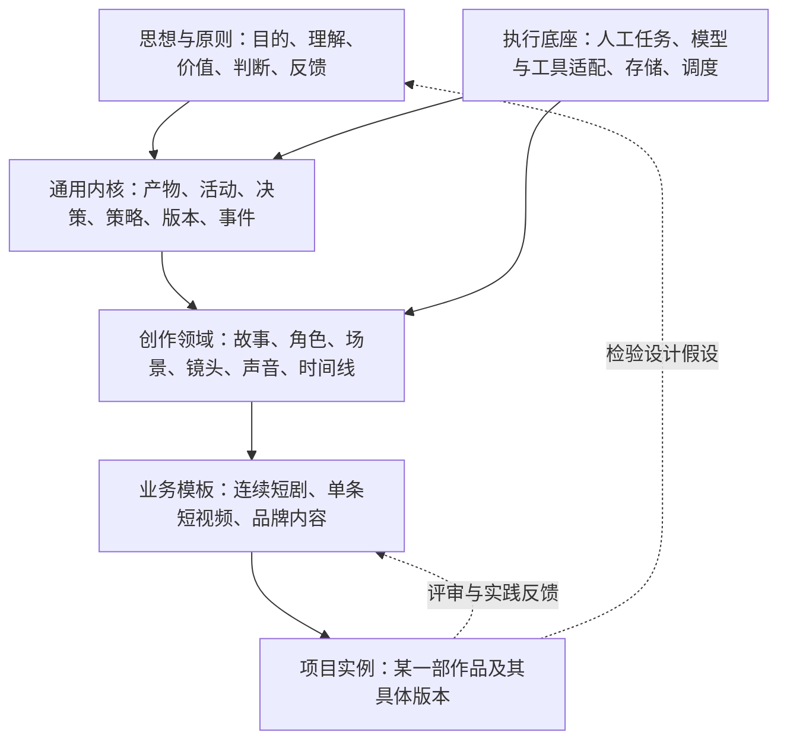

# VSC：短剧与短视频创作工作流

版本：0.2 · 研究日期：2026-10-01 · 状态：通用编排器骨架已实现；真实媒体生成适配器尚未接入

VSC 的目标，是让创作者把小说、原创故事或业务需求，持续转化为有叙事意图、视听表达和制作质量的短剧／短视频；同时允许不同团队在共同协议上建立自己的业务流程。

本提案的核心判断是：**VSC 应当围绕创作意图、版本化产物和反馈来组织工作。** 小说改编、分镜、运镜、转场、人物／动作／声音设定、场景、图像生成、视频生成、声音制作和剪辑，都是这个体系中的协作能力。

VSC 是**独立插件**，不嵌入或调用其他插件。小说、原创故事、品牌资料或任何外部工具的产物，都只作为来源文件或标准 `creative-handoff/v1` 交接包导入；VSC 自己负责其后的创作与制作编排。

## v0.2：已经可以怎样使用

VSC 现在拥有一名总编排器和六条熟手直达路径：

```bash
/vsc 把一部都市悬疑小说改成20集竖屏短剧
/vsc 我只有一个“雨夜收到假信”的想法，想做60秒短片
/vsc-adapt 为第1–3集设计改编方案
/vsc-script 重写第2集结尾
/vsc-direct 为第2集第4场编排镜头、运镜和转场
/vsc-assets 设计女主的外观、动作、声线和修表铺场景
/vsc-produce 为第12镜准备图像和图生视频候选计划
/vsc-post 审看预演并给出剪辑、BGM、音效和字幕方案
/vsc-vendor 审核一个准备本地使用的开源 Skill
```

新手可只说作品目标；`/vsc` 会给推荐、理由和少量备选，逐步收敛。熟手可直接进入环节，但仍共享同一套项目状态、版本、依赖与批准门。可执行的状态机见 `scripts/vsc_state.py`，升级方案见 [06 v0.2 升级方案](docs/06-vsc-v0.2-upgrade.md)。

## 本地开源 Skill／工具

第三方开源 Skill 或辅助工具可经审核后下载到 `vendor/`，并由本机的计划任务定期更新；下载内容不会进入 Git，仓库只记录来源、固定 commit、许可证证据、用途和审批结论。请注意，这并不自动取得商业使用权；许可证、NOTICE、模型权重、声音、图像和数据集权利仍要单独审核。详见 [07 Vendor 治理](docs/07-vendor-governance.md) 与 [vendor 安装说明](vendor/README.md)。

## 从哪里开始读

| 文档 | 回答的问题 |
| --- | --- |
| [01 思想基础与跨行业研究](docs/01-foundations-and-research.md) | 借鉴哪些思想？不同流程有什么共性？哪些类比不能照搬？ |
| [02 通用架构](docs/02-reference-architecture.md) | 通用内核是什么？如何扩展？如何处理版本、返工、预算和模型替换？ |
| [03 短剧与短视频创作体系](docs/03-creative-production.md) | 小说如何变成可制作、可剪辑的视听作品？ |
| [04 业务定制、完整示例与验证路线](docs/04-profiles-example-and-validation.md) | 不同业务如何使用同一内核？第一版怎样验证？ |
| [05 来源与证据边界](docs/05-sources.md) | 哪些来自公开资料，哪些是本项目的设计推论？ |
| [06 v0.2 升级方案](docs/06-vsc-v0.2-upgrade.md) | 研究如何落实为独立编排器、Profile、状态机与交接协议？ |
| [07 Vendor 治理](docs/07-vendor-governance.md) | 如何在本地审核、锁定、同步开源 Skill／工具，同时不将其提交到 Git？ |

面向创作者可按 01 → 03 → 04 阅读；面向开发者可按 02 → 03 → 04 阅读。

## 总体结构



这是一张职责图，不是要求按图部署六个服务。第一版可以是一个应用、一个数据库、一个媒体目录和几个可替换适配器。

## 贯穿体系的六个问题

1. **为什么做？** 受众、表达、目标和制作约束是什么？
2. **依据是什么？** 原文事实、创作者解释、改编决定分别是什么？
3. **有哪些选择？** 能否比较少量有意义的叙事和视听方案？
4. **产出了什么？** 每次工作是否留下可检查、可复用的版本化产物？
5. **怎样判断？** 技术合格、叙事有效和业务结果如何分别评价？
6. **如何改进？** 哪些内容需要返工，哪些经验可以迁移到下一部作品？

这六个问题是本提案对所选资料的归纳，不是宣称所有哲学和行业都接受同一套理论。

## 创作主线


其中人物、场景、道具、动作和声音资产可并行制作。图生视频是优先验证的生产路线，同时保留文生视频、参考视频、3D、实拍和混合制作的接入点。

## 第一版的关键选择

- 以小说改编连续短剧为首个验证场景，兼容单条剧情短视频；这是可调整的初始假设。
- 先建立故事、资产、镜头和时间线之间的共同数据结构，再接生成工具。
- 将人物设定、动作设计、声音设计与可选的 3D／训练过程分开。
- 先通过带临时对白和音效的分镜预演检验叙事，再扩大正式视频生成。
- 把批准、退回、局部重做和异常恢复设计为正式流程。
- 用一个完整短片样例和第二种业务模板检验架构，不预先建设复杂的服务集群。

## 本次交付的范围

已形成：代表性公开资料研究、思想原则、通用架构、创作流程、业务扩展规则、原创 60 秒纸面样例和实施验收计划。

尚未完成：模型实测、供应商选型、实际图像／视频生成、运行引擎、真实观众实验。因此，文档中的质量门槛、预算例子和自动化策略均为待验证的设计建议。

本次研究采用有目的的代表性取样，覆盖哲学、设计、影视动画、制造、软件、系统工程、流程标准和公开 AI 创作产品；不声称穷尽全部公开哲学或市场产品。来源事实与 VSC 推论在正文中分别标示。

## 许可证

VSC 自身的代码与文档采用 [MIT License](LICENSE)。这不改变 `vendor/` 中第三方 Skill、工具、模型权重、素材或数据集的许可证与使用限制；它们仍须按各自来源记录和授权条件使用。
