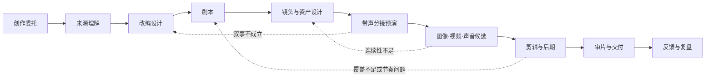
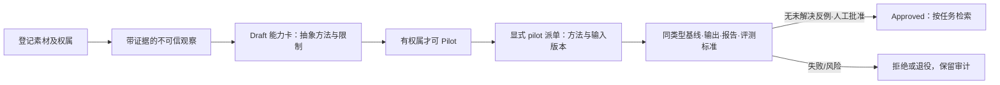

# VSC · Video Short Create

VSC 是一个独立的短剧／短视频创作工作流。它把小说、原创故事、品牌资料或外部交接包，组织为可追溯的：**改编 → 剧本 → 镜头与资产 → 预演 → 图像/视频/声音候选 → 剪辑 → 审片与交付**。

当前版本：**v0.9.0**。本次升级将创作目标、批准版本、前置依赖、分集范围、试用评测和真实媒体证据接入执行检查：产物登记保存快照，批准和下游消费检查内容 hash、契约及依赖；项目命令加锁，Profile 固定到项目；学习按任务检索并保留反例，跨项目方法导入后重新评测。Vendor 更新分析 Skill 与支持资源整体变化，失败可重试，不自动采用候选。

VSC 已有总编排器、12 类角色、3 种 Profile 和可校验的工作流内核；本地 Remotion 脚手架支持裁切、手柄和声画淡变，真实媒体 QA 与具名人工审片可进入交付 Gate。**尚未接入真实图像／图生视频／语音生成供应商，也未完成 AI 样片或 Remotion 实际渲染验收。** 角色卡、结构检查和测试通过都不等于专业作品质量已被证明。升级与迁移详见 [v0.9 升级说明](docs/13-v0.9-upgrade.md)。

VSC 不嵌入、不调用其他插件。任何外部系统都只能作为文件来源，或提供标准 `creative-handoff/v1` 交接包；VSC 对导入后的创作与制作负责。

## 为什么存在

短剧制作不应等同于“输入小说，连续调用几个生成模型”。真正需要被管理的是：

- 创作意图：为谁做、让观众看到什么、什么绝不能改；
- 来源依据：原文事实、人物说法、解释、改编、新增与待定不能混为一谈；
- 创作选择：剧本、表演、运镜、转场、音乐和最终 take 由明确责任人选择；
- 生产连续性：人物、场景、动作、声音和镜头参考必须跨镜、跨集可复用；
- 版本与返工：每份产物要有来源、依赖、批准状态与新鲜度；问题要退回最早的责任环节；
- 团队差异：不同工作室应能替换 Profile、角色、质量门和生成适配器，而不改写核心语义。
- 可持续复用：经过权属核验、试用和评测的创作方法应成为团队能力；来源素材、临时对话和未经验证的模型输出不能越过这个边界。

VSC 的基本立场是：**意图先于生成，产物先于任务，人对创作选择负责。**

## 两种入口

### 新手：只说需求

```text
/vsc 把一部都市悬疑小说改成 20 集竖屏短剧
/vsc 我只有“雨夜收到假信”的想法，想做一条 60 秒剧情短片
```

`/vsc` 会识别已有来源、受众、时长/画幅、目标、约束和责任人；信息不足时给出一项推荐和少量备选，每轮只收敛一个会影响后续工作的决定。它再选择 Profile，安排专业角色，并把产物与决定记录进项目状态。

### 熟手：直接打磨一个环节

| 目标 | 命令 | 主要工作 |
|---|---|---|
| 小说理解、改编契约、分集 | `/vsc-adapt` | 来源映射、故事底稿、改编与分集设计 |
| 场次、对白、节奏 | `/vsc-script` | 可表演、可拍摄、可听的剧本 |
| 镜头、运镜、转场、预演 | `/vsc-direct` | ShotPlan、视觉语法、Animatic |
| 多片段连续性与转场 | `/vsc-continuity` | 出入点状态、参考资产、手柄、桥接策略与返工路由 |
| BGM、环境声、声音桥 | `/vsc-sound` | 情绪 Cue、环境底、J/L Cut、音乐层与混音提示 |
| 人物、动作、声音、场景 | `/vsc-assets` | AssetBible、参考资产与连续性约束 |
| 图像、图生视频、音频候选 | `/vsc-produce` | 供应商中立的生成计划与 take 记录 |
| 剪辑、BGM、音效、字幕、审片 | `/vsc-post` | Timeline、Mix、审片与交付 |
| 可编辑预演与确定性导出 | `/vsc-remotion` | Composition、字幕与本地渲染计划 |
| VSC / Profile / 适配器架构维护 | `/vsc-architecture` | 公开架构 Skill、术语表、ADR 与可视化审计 |
| 从素材沉淀受控方法 | `/vsc-learn` | 观察、能力卡、试用、评测与晋升 |
| 本地开源 Skill/工具 | `/vsc-vendor` | 来源审核、固定版本和本地同步 |

熟手不会被迫重走访谈；VSC 只读取当前环节所需的已批准产物，并补足受影响的依赖。

## 生产主线



在 S6 中，图片、视频、声音都是候选 take，不会因为“生成成功”自动进入成片。带临时对白、音效和音乐节拍的 S5 预演，是在扩大生成成本前检验叙事、时长和镜头关系的关键点。

## 立即开始

VSC 的状态机只依赖 Python 标准库：

```bash
# 先确认每一个命令、Skill、角色、Profile、模板和校验器都真实存在
python3 scripts/vsc_kernel.py doctor

# 查看可选业务 Profile
python3 scripts/vsc_state.py profile list

# 新建一个小说连续短剧项目
python3 scripts/vsc_state.py init ./projects/雨夜来信 \
  --title "雨夜来信" \
  --profile vsc.novel-serial \
  --owner "导演"

# 查看下一关缺什么
python3 scripts/vsc_state.py status ./projects/雨夜来信
python3 scripts/vsc_state.py next ./projects/雨夜来信

# 登记小说或其他来源；脚本只记录路径与 SHA，不复制原文
python3 scripts/vsc_state.py source add ./projects/雨夜来信 \
  --kind novel --file ./source/雨夜来信.txt

# init 已生成 00-委托/创作委托.json；先填写观众、体验、目标顺序、
# 不可牺牲的约束、冲突裁决与责任人。模板占位内容不能批准。
python3 scripts/vsc_state.py artifact add ./projects/雨夜来信 \
  --type vsc.creative_brief --stage brief \
  --file ./projects/雨夜来信/00-委托/创作委托.json
python3 scripts/vsc_state.py artifact decide ./projects/雨夜来信 A-0001 \
  --status approved --by "导演"

# brief 通过后，继续完成来源、改编等前置产物
python3 scripts/vsc_state.py gate check ./projects/雨夜来信 brief
python3 scripts/vsc_state.py next ./projects/雨夜来信
```

`vsc.json` 是项目的状态权威，schema 为 3。登记产物时将源文件保存到 `09-台账/产物/` 的独立版本目录；修改工作文件不会改变已批准快照。修改／删除快照、拒绝或替代上游版本会使下游检查失败。返工用新产物与 `--supersedes`，不要编辑批准快照。默认 Profile 要求显式依赖前一阶段全部基线；连续短剧从剧本起按 `--scope EP-ID` 分集验收。具体编号以命令输出为准。

脚本不会替你调用生成模型、支付费用、发布内容或作出创作批准。状态锁适用于本机项目 CLI；其他工具应调用 CLI，不应直接覆写 `vsc.json`。

## 剧本化、连续性与声音

短剧不是“把小说喂给模型，再把 6 秒视频拼起来”。VSC 要求先把小说映射为集钩子和场景单元：每场都有来源、可见行动、人物目标、阻力、转折和观众新增信息；再把每段生成视频写成有入点和出点的镜头单元。

```text
小说来源 → 改编映射 → 场景剧本 → 资产/镜头 → 连续性计划 → 候选片段 → 声音提示表 → 时间线
```

```bash
# 阻止“有梗概、没有可拍场景”的改编假完成
python3 scripts/vsc_kernel.py contract validate vsc.adaptation-map/v1 ./projects/雨夜来信/02-改编/改编映射.json

# 阻止前一段出点与后一段入点在动作、服装、方向、场景等关键字段上自相矛盾
python3 scripts/vsc_kernel.py contract validate vsc.continuity-plan/v1 ./projects/雨夜来信/05-预演/连续性计划.json

# 检查 BGM/环境底的跨镜覆盖和 J/L cut、crossfade 等声音桥参数
python3 scripts/vsc_kernel.py contract validate vsc.sound-cue-sheet/v1 ./projects/雨夜来信/07-后期/声音提示表.json
```

可从 [改编映射模板](templates/adaptation-map.json)、[连续性计划模板](templates/continuity-plan.json) 和 [声音提示表模板](templates/sound-cue-sheet.json) 复制开始。每段 AI 视频都需绑定角色/场景参考资产、入点状态、出点状态及剪辑手柄。BGM、环境底、对白和音效则按场景与情绪弧线跨镜铺在时间线上；它们不会随每个 6–8 秒片段重新开始。完整方法、JSON 协议和公开资料依据见 [生产连续性与声音](docs/09-production-continuity-and-sound.md)。

统一契约命令检查文件结构，不自动知道它属于哪个项目。使用 `adaptation|continuity|sound validate FILE --project PROJECT` 可额外核对对象引用；批准与 Gate 会自动执行项目检查。先用 `object add` 登记集、场、sequence、镜头、take 与参考资产；它们使用不同且唯一的 ID。资产必须绑定有效已批准版本，不能仅写一个不存在的角色名。

交付还需实际成片的 `vsc.media-qa/v1` 技术报告，以及 `vsc.sample-review/v1` 人工审片记录。审片覆盖剧情动机、物理连续性、情绪连续性、剪辑覆盖、对白与音乐，并记录耗时、成本和失败。详见 [专业制作证据链](docs/14-production-evidence.md)。

## 角色记忆、上下文与学习能力

每个 VSC 角色都有固定的身份、工作人格、权限与记忆边界。例如故事分析师证据优先、导演避免无目的炫技、生成制作人严格区分候选与成片。它们只在 [`workflow/roles.json`](workflow/roles.json) 中定义，`agents/` 是宿主入口；角色定义**不能**被素材、角色台词或当前对话自动重写。

子角色不接收主智能体的整段聊天记录，而接收可审计的任务上下文包：有效已批准产物、按任务相关性和字符预算选出的记忆／方法，以及会话摘要。摘要保存于任务包文件，但不写入 `vsc.json` 或长期记忆，也不自动清理；这不是真正的“只在内存中临时存在”。当前检索采用词汇与领域匹配，不是向量语义检索。

```bash
# 先把人审过的项目经验登记为 draft，再批准
python3 scripts/vsc_state.py memory add ./projects/雨夜来信 \
  --scope role --role director --kind lesson --source A-0003 \
  --content "反转前先给观众一个可误读的视觉线索。"
python3 scripts/vsc_state.py memory decide ./projects/雨夜来信 M-0001 \
  --status approved --by "导演"

# 为子角色生成最小上下文；parent-brief 不写入长期状态
python3 scripts/vsc_state.py context build ./projects/雨夜来信 \
  --role director --task "编排第 1 集雨夜追逐" --artifact A-0003 \
  --parent-brief "用户确认节奏要紧张，但不使用血腥表现。"
```

“从视频、图片或文本学习武术、打斗、特效、布局、情绪、对白或声音”在 VSC 中是一个受控闭环，而非让系统照搬素材或自行训练：



```bash
# owned/licensed 才可能晋升；unknown / analysis_only 只能停留在研究观察
python3 scripts/vsc_state.py source add ./projects/雨夜来信 \
  --kind video --file ./references/动作样片.mp4 --rights owned
python3 scripts/vsc_state.py learn observe ./projects/雨夜来信 \
  --kind action --source S-0002 --file ./notes/动作五拍.md \
  --content "将起势、交手、受击、停顿、反转分成五拍，并检查方向线。"
python3 scripts/vsc_state.py capability propose ./projects/雨夜来信 \
  --name "五拍动作节奏" --kind action --observation O-0001 --role director \
  --method "按五拍拆镜头，为每拍标注方向线和情绪转折。" \
  --limits "仅用于有授权项目；不复制人物、声音、特定作品或受保护风格。"
python3 scripts/vsc_state.py capability decide ./projects/雨夜来信 C-0001 \
  --status pilot --by "导演"

# 显式试用，不把 pilot 自动送进普通任务；A-0003 应是有效已批准输入
python3 scripts/vsc_state.py context build ./projects/雨夜来信 \
  --role director --task "比较五拍方法对动作方向的帮助" \
  --artifact A-0003 --pilot C-0001 --budget-chars 12000
```

评测需绑定 `--context`、`--output`、`--baseline`、`--evidence` 与 `--criteria`；输出依赖试用输入，报告依赖输出和同类型、同范围的比较基线。一次 pass 后出现 fail 会阻断晋升；只有同方法、同输入、同基线、同标准的明确重测 `--resolves EV-ID` 才能解决对应失败。单次通过只满足程序条件，不证明专业效果或泛化能力。

`capability export/import` 可跨项目传递人工去项目化的方法，不能夹带观察、项目事实、记忆和评测字段。导入后是 draft，需本项目复核和重新试用；不会继承其他项目的批准。能力卡不会自动变成 LoRA／微调、声音克隆或供应商调用。

旧 schema 1/2 项目需显式迁移；先备份原状态，旧产物与旧能力降为 draft，保留历史但不能当作新规则下有效批准。schema 1 未声明权属的来源补为 `unknown`。当前 Profile 与历史版本不同且无法恢复时，脚本会停止，只有负责人确认后才能加 `--accept-current-profile`：

```bash
python3 scripts/vsc_state.py migrate ./projects/雨夜来信
```

## 可扩展 Profile

| Profile | 默认用途 | 重点质量门 |
|---|---|---|
| `vsc.narrative-base` | 原创剧情短片、一般叙事短视频 | 创作委托、来源理解、预演、时间线 |
| `vsc.novel-serial` | 小说改编连续短剧 | 改编契约、故事圣经、分集、声音方案、混音 |
| `vsc.brand-story` | 品牌叙事短视频 | 素材范围、产品主张映射、表达与用途审核 |

复制 `profiles/` 中的 JSON 即可定制阶段、必需产物与规则。项目固定使用创建／迁移时的完整 Profile 快照，插件更新不静默改变既有项目。`dependency_policy: previous_stage` 要求前一阶段基线；`explicit` 只核对已声明依赖，不能检测漏声明。`scope_required_from` 控制从哪个阶段逐集验收。请保持 `vsc.*` 类型语义稳定。

## 外部来源与插件边界

VSC 接受小说、原创文本、品牌资料、素材库或 `creative-handoff/v1` JSON 清单。交接包只包含来源身份、允许范围、版本化来源产物和既有决定；导入后仍要在 VSC 中重新形成并批准本项目的 StoryMap、改编方案、剧本和镜头资产。

这使来源工具与 VSC 保持独立：不会互相调用、不会共享内部状态、不会要求在同一目录安装。协议详情见 [外部来源与交接](skills/vsc/references/source-handoff.md)。

## 本地 Vendor：第三方 Skill/工具

可选开源 Skill 和辅助工具可放在本地 `vendor/`，但下载内容不提交到 Git。仓库只提交第三方来源声明、安装说明、许可证证据和用途说明。

VSC 核心自身保持 MIT；这不妨碍直接使用 AGPL、Apache、MIT 等其他许可证的开源内容。除了只读参考、独立本地工具、独立服务和协议适配器，VSC 还支持将完整上游项目固定版本下载到本地 `vendor/`，作为 `local_component` 直接调用其原生 Skill、脚本或 CLI。根目录 MIT 只覆盖 VSC 自研部分，不替代第三方的许可证、NOTICE、网络服务、模型和素材权利义务，也不会把第三方代码伪装成 MIT。

因此，**AGPL-3.0 和 Apache-2.0 都是可接受的来源**，不是被排除的来源。当前 Vendor 模式不分发其完整源码；若未来把第三方源码复制/融合进 VSC 的可发布模块，则需保留该模块的原许可证边界与相应源码、NOTICE 义务。尤其是 AGPL 融合模块不能整体宣称为“仅 MIT”。

```bash
python3 scripts/vendor_sync.py --check  # 不联网、不下载
python3 scripts/vendor_sync.py --plan   # 不联网、不下载
python3 scripts/vendor_sync.py --write-declaration  # 由来源锁定文件生成 vendor/THIRD_PARTY.md
python3 scripts/vendor_sync.py --install inkos openwrite  # 用户按需安装指定来源
python3 scripts/vendor_sync.py --install remotion  # 安装可选的本地时间线、预览与渲染 Skill
python3 scripts/vendor_sync.py --install mattpocock-skills  # 安装公开的架构改进及其依赖 Skill
python3 scripts/vendor_sync.py --install  # 用户安装全部已声明、固定到 40 位 commit 的来源
python3 scripts/vendor_skills.py --scan  # 扫描已下载的上游 SKILL.md，写入本机目录
python3 scripts/vendor_skills.py --resolve adapt  # 查看改编阶段可直接使用的 Skill
```

不提交第三方源码只能降低再次分发的风险，**不等于获得商业使用权**。`sources.lock.json` 是机器可读的来源真相，`vendor/THIRD_PARTY.md` 是从它生成的公开声明；用户自行运行安装脚本。许可证、NOTICE、模型权重、声音、图像、数据集、商标和平台条款仍须逐项确认。详见 [第三方声明](vendor/THIRD_PARTY.md)、[Vendor 治理](docs/07-vendor-governance.md) 与 [Vendor 安装说明](vendor/README.md)。

安装完成后，`vendor_skills.py` 会发现上游项目内的原始 `SKILL.md`；`/vsc-adapt`、`/vsc-script`、`/vsc-direct`、`/vsc-assets`、`/vsc-produce`、`/vsc-sound`、`/vsc-post` 分别按阶段路由并直接读取这些 Skill。方法型 Skill 可立即复用；需要 OpenWrite Bridge、ffmpeg、MCP、模型服务或 API 凭据的原生 Skill 会标记所需环境，只有环境实际就绪才执行。

### Vendor 最新性不是自动采用

VSC 候选维护改为用户按需运行脚本，`sources.lock.json` 的 `scheduler` 为 `manual`，不依赖 ZCode 定时任务、cron 或后台常驻服务：

```bash
bash scripts/vsc-vendor-maintenance.sh --plan  # 只预览，不联网、不写入
bash scripts/vsc-vendor-maintenance.sh         # 执行一次全部来源候选分析，不采用
bash scripts/vsc-vendor-maintenance.sh --source mattpocock-skills  # 只检查指定来源
```

每次执行分析 Skill、引用规则／脚本／参考文件，以及许可证和依赖声明；下载完成与分析完成分开记录，失败或报告损坏会重审。新增不自动路由；删除已引用 Skill 要明确保留、替换或退役。候选资源包在执行时按每来源 90 天、最多 3 份清理（含基线）；不运行脚本时不会后台清理，因此文件可能超过 90 天，下一次执行时才处理。它不是完整仓库、已安装运行环境或模型权重备份。

检查当次输出、报告和退出码；脚本只做结构分析，不自动调用模型。需要语义评估时手动调用 `/vsc-vendor` 阅读报告与 diff，由负责人决定是否采用，通过后才显式修改固定 revision 并安装。缓存路径、旧中央入口兼容和资源恢复说明见 [候选更新文档](docs/12-vendor-candidate-updates.md)。

## 当前边界与路线

**已经实现**：总编排与专业入口、声明内核、创作目标契约、项目 Profile 固定、本机串行状态写入、产物快照与内容／依赖／范围验收、创作对象引用、受控检索与版本绑定评测、反例处理、跨项目方法包、完整 Skill 资源候选与可重试分析、本地媒体 QA 和具名人工审片。`doctor` 检查声明可达性，不证明角色拥有独立专业能力。

**本机可选后期层**：手动整理选定镜头、声音与字幕为 `vsc.remotion-render-plan/v1`，生成 Composition 脚手架，支持源范围、手柄、分数帧率和音量包络。依赖安装、完整 TypeScript 编译、Studio 与实际渲染仍需在生成项目中验证；尚没有从全部 VSC 台账自动转换为时间线的编译器。

**尚未实现**：真实图像/视频/语音供应商适配器、媒体存储、任务队列、成本账本、自动连续性检测、可视化时间线、真实观众实验与发布集成，以及真实模型训练/微调。它们必须在具体账户、地区、预算、数据/人格/声音授权和真实样片验证后接入，不应由架构文档假装完成。

下一阶段优先验证一条真实链路：一个 60 秒原创短片或一集小说短剧，从来源到带声预演，再到少量已批准镜头的图像/图生视频候选与人工审片。

## 文档与验证

| 文档 | 内容 |
|---|---|
| [01 思想基础与跨行业研究](docs/01-foundations-and-research.md) | 哲学、设计、影视、软件和系统工程的共性与边界 |
| [02 通用架构](docs/02-reference-architecture.md) | 产物、活动、决策、策略、版本、事件与可扩展内核 |
| [03 创作体系](docs/03-creative-production.md) | 从改编到镜头、资产、生成、后期和交付 |
| [04 Profile 与验证](docs/04-profiles-example-and-validation.md) | 业务定制、纸面样例和验证路线 |
| [05 来源与证据边界](docs/05-sources.md) | 公开研究资料与项目推论的边界 |
| [06 v0.2 升级方案](docs/06-vsc-v0.2-upgrade.md) | 架构如何落为插件骨架 |
| [07 Vendor 治理](docs/07-vendor-governance.md) | 本地开源 Skill/工具的审核、锁定和同步 |
| [08 记忆与能力学习](docs/08-memory-and-capability-learning.md) | 角色身份、任务上下文、素材观察、能力卡、评测与安全边界 |
| [09 生产连续性与声音](docs/09-production-continuity-and-sound.md) | 剧本化、跨 AI 片段状态契约、BGM/环境声与时间线策略 |
| [10 Remotion 集成](docs/10-remotion-integration.md) | VSC 时间线到可编辑预演和确定性渲染的本机接口 |
| [11 架构重构](docs/11-architecture-refactor.md) | 结构问题、可执行内核和扩展规则 |
| [12 Vendor 候选更新](docs/12-vendor-candidate-updates.md) | 手动候选脚本、Skill 分析、采用与快照保留 |
| [13 v0.9 升级](docs/13-v0.9-upgrade.md) | 四维审查对应的实现、兼容性、使用与剩余边界 |
| [14 专业制作证据](docs/14-production-evidence.md) | 媒体范围、真实成片检查与人工审片 |
| [工作流内核](workflow/README.md) | 单一事实来源、稳定查询/校验接口与扩展方式 |
| [架构决策 ADR](docs/adr/README.md) | 影响长期结构的可追溯决定 |

```bash
python3 -B tests/test_vsc_state.py
python3 -B tests/test_vsc_kernel.py
python3 -B tests/test_vendor_sync.py
python3 -B tests/test_vendor_skills.py
python3 -B tests/test_vendor_review.py
python3 -B tests/test_remotion_plan.py
python3 -B tests/test_vsc_integrity.py
python3 -B tests/test_vsc_learning.py
python3 -B tests/test_media_qa.py
python3 -B tests/test_vendor_watch.py
python3 -B tests/test_vsc_local_ci.py
python3 -B tests/test_vsc_hosts.py
python3 -B tests/test_vsc_pre_commit.py

# 或一次运行全部本地测试
python3 -B -m unittest discover -s tests -p 'test_*.py'
```

维护 VSC 时直接提交并推送 `main`。vendor 与作品只在本机，验证也只在本地：推送前运行本地 CI，依次检查 doctor、全部测试、vendor 版本与路由、`projects/` 中作品可读性，以及 Git 跟踪文件不含作品、vendor 源码或本机配置。流程见 [vsc-architecture](skills/vsc-architecture/SKILL.md)。

```bash
python3 -B scripts/vsc_local_ci.py

# 每个克隆启用一次：启用提交前同步与推送前本地 CI
git config core.hooksPath .githooks
```

每次普通 `git commit` 前，钩子都会获取 `origin/main`。当前分支已包含最新 main 时直接提交；需要更新时，先保存暂存、未暂存及未跟踪文件，合并 main，再恢复修改及暂存状态。忽略的作品、vendor 源码与本机配置不进入 stash，也不允许被合并覆盖。由于合并会推进 HEAD，本次提交会中止；检查 `git diff --cached` 并重跑本地 CI 后重新执行 `git commit`。有更新时不自动处理 `git commit -a/--only` 等临时索引提交，请先 `git add` 再普通提交。

获取失败、合并冲突或恢复修改失败都会阻止提交。合并失败时，原有修改保留在钩子输出的 stash 中：先解决或中止合并，再按提示 `git stash apply --index <stash-id>` 恢复。若恢复时发生冲突，先检查 `git status`，不要直接重复 apply。不要用 `--no-verify` 或关闭 hooks 绕过同步。推送前仍运行本地 CI，且工作区须已提交。

## 许可证

VSC 自身代码和文档采用 [MIT License](LICENSE)。`vendor/` 中第三方代码、Skill、工具、模型权重、素材或数据集不因 VSC 使用 MIT 而改变其各自许可证或使用限制。
