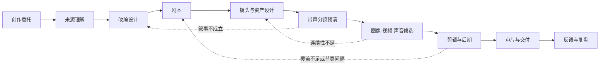

# VSC · Video Short Create

VSC 是一个独立的短剧／短视频创作工作流。它把小说、原创故事、品牌资料或外部交接包，组织为可追溯的：**改编 → 剧本 → 镜头与资产 → 预演 → 图像/视频/声音候选 → 剪辑 → 审片与交付**。

<!-- vsc:view version -->
当前版本：**v0.9.0**，各版本变化见 [版本记录](docs/releases/)。
<!-- /vsc:view -->

VSC 不嵌入、不调用其他插件。任何外部系统都只能作为文件来源，或提供标准 `creative-handoff/v1` 交接包；VSC 对导入后的创作与制作负责。

## 为什么存在

短剧制作不应等同于“输入小说，连续调用几个生成模型”。真正需要被管理的是：

- 创作意图：为谁做、让观众看到什么、什么绝不能改；
- 来源依据：原文事实、人物说法、解释、改编、新增与待定不能混为一谈；
- 创作选择：剧本、表演、运镜、转场、音乐和最终 take 由明确责任人选择；
- 生产连续性：人物、场景、动作、声音和镜头参考必须跨镜、跨集可复用；
- 版本与返工：每份产物要有来源、依赖、批准状态与新鲜度；问题要退回最早的责任环节；
- 团队差异：不同工作室应能替换 Profile、角色、质量门和生成适配器，而不改写核心语义。
- 可持续复用：经过权属核验、试用和评测的创作方法应成为团队能力；来源素材、临时对话和未经验证的模型输出不能越过这个边界。

VSC 的基本立场是：**意图先于生成，产物先于任务，人对创作选择负责。**

## 两种入口

### 新手：只说需求

```text
/vsc 把一部都市悬疑小说改成 20 集竖屏短剧
/vsc 我只有“雨夜收到假信”的想法，想做一条 60 秒剧情短片
```

`/vsc` 会识别已有来源、受众、时长/画幅、目标、约束和责任人；信息不足时给出一项推荐和少量备选，每轮只收敛一个会影响后续工作的决定。它再选择 Profile，安排专业角色，并把产物与决定记录进项目状态。

### 熟手：直接打磨一个环节

各环节的命令、route 与角色见 [AGENTS.md 的路由表](AGENTS.md)（由 `workflow/kernel.json` 生成）。

熟手不会被迫重走访谈；VSC 只读取当前环节所需的已批准产物，并补足受影响的依赖。

## 生产主线



在 S6 中，图片、视频、声音都是候选 take，不会因为“生成成功”自动进入成片。带临时对白、音效和音乐节拍的 S5 预演，是在扩大生成成本前检验叙事、时长和镜头关系的关键点。

## 快速开始

在 Codex、Claude Code、Grok Build、Kimi Code 或 ZCode 中打开仓库根目录，开始新会话后直接说“用 VSC……”，或使用 `/vsc`（Codex 为 `$vsc`）。各客户端读取哪些入口、需要注意什么，见 [AI 客户端接入](docs/guide/workspace-setup.md)。

也可以直接使用命令行，状态机只依赖 Python 标准库：

```bash
python3 -B scripts/vsc_kernel.py doctor        # 核对内核、入口与各客户端配置
python3 -B scripts/vsc_state.py profile list   # 查看可选业务 Profile
python3 -B scripts/vsc_state.py init ./projects/雨夜来信 --title "雨夜来信" --profile vsc.novel-serial --owner "导演"
python3 -B scripts/vsc_state.py next ./projects/雨夜来信
```

来源登记、批准、契约校验、记忆与学习、Profile 定制和外部交接的完整用法，见 [命令行使用](docs/guide/cli.md)。

## 当前边界与路线

**已经实现**：总编排与专业入口、声明内核、创作目标契约、项目 Profile 固定、本机串行状态写入、产物快照与内容／依赖／范围验收、创作对象引用、受控检索与版本绑定评测、反例处理、跨项目方法包、完整 Skill 资源候选与可重试分析、本地媒体 QA（含响度）和具名人工审片；资产库、场景状态时间线与生成锚定（锚点包与生成记录）的一致性校验；预演临时配音与字幕、字幕烧录、剪映草稿导出（见[本机制作工具](docs/architecture/generation-adapters.md)）。`doctor`、结构检查和测试通过只证明声明可达与行为正确，不证明角色拥有独立专业能力或作品质量。

**本机可选后期层**：手动整理选定镜头、声音与字幕为 `vsc.remotion-render-plan/v1`，生成 Composition 脚手架，支持源范围、手柄、分数帧率和音量包络。依赖安装、完整 TypeScript 编译、Studio 与实际渲染仍需在生成项目中验证；尚没有从全部 VSC 台账自动转换为时间线的编译器。

**尚未实现**：用于正式交付的图像/视频/语音生成适配器（现有 edge-tts 只用于预演临时配音）、AI 样片与 Remotion 实际渲染验收、媒体存储、任务队列、成本账本、画面级自动连续性检测（人脸、服装、道具、声纹比对）、可视化时间线、真实观众实验与发布集成，以及真实模型训练/微调。它们必须在具体账户、地区、预算、数据/人格/声音授权和真实样片验证后接入，不应由架构文档假装完成。

下一阶段优先验证一条真实链路：一个 60 秒原创短片或一集小说短剧，从来源到带声预演，再到少量已批准镜头的图像/图生视频候选与人工审片。

## 文档地图

全部文档按读者分组列在 [docs/README.md](docs/README.md)。

## 许可证

VSC 自身代码和文档采用 [MIT License](LICENSE)。第三方来源的许可证与使用须知见 [第三方声明](vendor/THIRD_PARTY.md)，原则见 [Vendor 治理](docs/governance/vendor-governance.md)。
