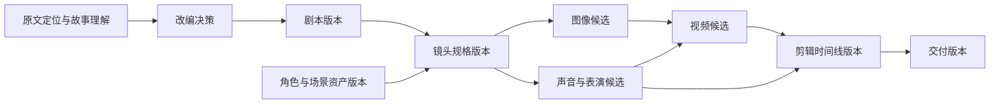
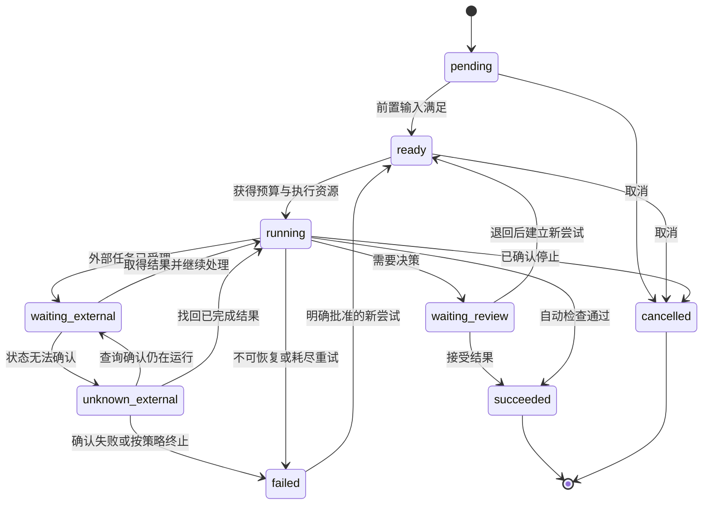

# 02 · VSC 通用架构

版本：0.2。本文中的通用对象和语义仍是架构设计；v0.2 已以 `scripts/vsc_state.py`、`profiles/` 和 VSC 命令/角色实现最小可运行骨架，尚未接入真实媒体生成、任务队列或供应商适配器。设计依据见 [01 研究](01-foundations-and-research.md)，升级落地见 [06](06-vsc-v0.2-upgrade.md)。

## 1. 架构目标与边界

VSC 要支持：从素材到成片；从个人到团队；从人工到受控自动化；从一个生成供应商到多个供应商；从一个业务流程到多个业务模板。

本提案把“通用”定义为：更换业务顺序、角色、创作风格、输入类型或供应商时，可以继续使用共同的产物、活动、决策、版本与事件协议。通用不等于所有团队使用同一张流程图。

第一阶段边界是“创作、制作、审片、形成交付包”。真实发布、营销投放、平台运营和商业结算可以扩展接入，其外部动作由项目策略授权。本次架构研究不执行这些动作。

## 2. 五个逻辑层与一个执行底座

| 层 | 职责 | 典型内容 | 允许业务定制的程度 |
| --- | --- | --- | --- |
| L0 思想与原则 | 说明系统为什么这样设计 | 创作价值、知识依据、人机责任、反馈方法 | 项目可设价值优先级；违反公共契约需显式升级设计 |
| L1 通用协议与内核 | 管理工作、产物和决策 | 类型、版本、依赖、活动、状态、策略、事件 | 通过公开扩展点扩展，不直接改核心语义 |
| L2 创作领域 | 理解故事和视听对象 | 故事、剧本、角色、场景、镜头、声音、时间线 | 增加类型与规则，保留标准字段 |
| L3 业务模板 | 组织具体业务方式 | 连续短剧、剧情短视频、品牌视频、音乐短片 | 调整阶段、顺序、默认值、评审和路由 |
| L4 项目实例 | 固定某次创作的具体选择 | 某部小说、某一集、选中的模板版本与制作预算 | 在模板允许范围内覆盖；关键改变形成新版本 |
| 执行底座 | 真正保存、调度和完成任务 | 数据库、媒体存储、人工任务、工具适配、任务队列 | 可替换部署与供应商实现 |

逻辑层不等于微服务。初版推荐模块化单体，模块边界按职责分开；只有并发、团队或部署需要明确时再拆服务。

## 3. 通用内核处理的对象

| 对象 | 含义 | 至少需要的信息 |
| --- | --- | --- |
| Intent 目标 | 为什么开展这项工作 | 受众、目的、成功条件、约束、责任主体 |
| Artifact 产物 | 可保存与检查的工作结果 | ID、类型、版本、内容引用、摘要、来源、状态 |
| Activity 活动定义 | 一种可执行的转换或评审 | 输入输出类型、实现版本、前置条件、失败与重试策略 |
| Actor 执行／决策主体 | 人、工具或模型适配器的身份 | 职责、权限、实现或成员标识；不把模型人格当作责任人 |
| Decision 决策 | 对确定候选作出的选择 | 目标版本、意见、结果、理由、主体、时间、适用范围 |
| Policy 策略 | 约束允许的执行方式 | 预算、授权、质量规则、数据范围、自动化级别 |
| WorkflowDefinition 流程定义 | 某种工作的结构 | 节点、依赖、分支、等待、循环边界、定义版本 |
| Run 运行实例 | 对固定输入的一次执行 | 流程快照、输入版本、节点实例、预算账本、当前状态 |
| Event 事件 | 已经发生的状态变化 | 唯一事件 ID、主体、时间、关联运行、前后状态、幂等标识 |

Gate（检查点）不是额外的一套神秘机制：它由一项评审活动、一组策略和一份 Decision 构成。可以由人完成，也可以在项目已授权且规则适用时自动完成。

设计借鉴了 [W3C PROV 的实体／活动／主体关系](https://www.w3.org/TR/prov-overview/)和[影视交付中的版本、状态与清单](https://partnerhelp.netflixstudios.com/hc/en-us/articles/4409337964819-Feature-Animation-at-Netflix-FAN-CSV-Manifest-Requirements)，但上述对象集合是 VSC 自己的设计。

## 4. 三种关系与一条时间线

应分别表达四类信息，避免把它们压成一张任务 DAG。

| 结构 | 回答什么 | 例子 |
| --- | --- | --- |
| 故事与意图关系 | 角色为何行动？信息怎样揭示？ | 因为看见印章错误，所以怀疑来访者；观众比角色先看见线索 |
| 产物依赖图 | 哪个版本由哪些版本产生？ | 镜头视频 v3 使用参考图 v2、动作规格 v4、声音 v1 |
| 执行状态图 | 任务接下来做什么？ | 等待生成、等待审片、退回、重试、暂停、取消 |
| 剪辑时间线 | 观众何时看到和听到什么？ | 第 8 秒进入对白，声音提前跨入下一镜，字幕持续 36 帧 |

故事中可以有倒叙；工作流程可以返工循环；产物版本依赖在同一生成血缘中应保持无环。返工通过新版本表达，避免“v2 同时依赖自己”这样的关系。



上图只是图生视频兼用独立音轨的一个示例。没有对白的镜头无需把声音作为生成依赖；一次生成原生音画的候选则同时产生相关联的媒体产物。

## 5. 创作领域的数据边界

| 对象组 | 主要对象 | 关键区分 |
| --- | --- | --- |
| 素材与依据 | SourceDocument、SourceSpan、Claim、AdaptationDecision | 原文事实、解释、改编、新增内容分开 |
| 故事组织 | StoryBible、Episode、Beat、ScriptScene | 故事发生顺序与呈现顺序分开 |
| 可复用身份 | Character、Location、Prop、StyleBible | 稳定身份与具体服装、姿态、布景变体分开 |
| 表演与声音 | ActionSpec、VoiceProfile、DialogueLine、SoundCue | 动作意图与动作实现、声线与单句表演分开 |
| 视听拍摄 | ShotSpec、ShotAssetBinding、ContinuityState | 镜头意图、绑定资产与当前剧情状态分开 |
| 生产结果 | ImageTake、VideoTake、AudioTake、Review | 生成候选与被选中的版本分开 |
| 剪辑交付 | Timeline、SubtitleTrack、Mix、DeliveryManifest | 媒体素材与如何使用素材分开 |

小说章节与短剧集数是多对多关系：一章可拆成多集，多章可合成一场戏。每个重要改编 Beat 应保留原文定位或明确标记“原创新增”。

同一个 ShotSpec 可以有多个候选 take，也可以由几个生成片段组装完成。若组装引入真实剪切，时间线必须表达剪切；不能仍把它伪装成一个连续长镜头。

## 6. 数据契约

### 6.1 通用产物外壳

以下 YAML 展示字段关系，不是可直接执行的文件格式标准。

```yaml
artifact_id: shot_s05_video
project_id: demo_drama
type: vsc.video_take
schema_version: "0.1"
revision: 3
content:
  uri: media://demo_drama/s05/take_03.mp4
  digest: "<content-hash>"
depends_on:
  - artifact: shot_s05_spec
    revision: 2
    usage: motion_and_framing
  - artifact: shot_s05_keyframe
    revision: 1
    usage: start_frame
generated_by:
  run_id: run_017
  activity_version: image_to_video@0.1
  adapter_version: adapter_demo@0.1
  provider_model_revision: "<captured-when-available>"
  parameters_ref: artifact://request_017@1
  provider_job_id: "<job-id>"
review_status: submitted
rights_refs: [project_material_scope_v1]
```

授权记录是资料与用途的引用，不是一个未经核验的 `copyright=true` 布尔值。来源是公开网页、模型生成或内部素材，都不能自动推导出所有用途均获授权。

### 6.2 依赖与版本规则

1. 被运行使用或评审过的产物版本不可原地覆盖；修改创建新版本。
2. 正式运行固定依赖版本；`latest` 仅可用于界面发现，进入运行时解析成确定版本。
3. 每个引用记录用途，例如角色脸部、服装、声线、道具位置；否则无法做精确影响分析。
4. 初版可按整个产物保守标记影响；只有字段读取关系可信时，才优化到字段级。
5. 批准只针对确定版本与依赖快照。上游变化后产生复核事项，旧批准不自动覆盖新版本。
6. 已发布的交付包固定素材和决策清单。更新作品产生新交付版本，旧版保持可追溯。

### 6.3 活动契约

活动至少声明：接受什么类型、输出什么类型、使用哪些能力、是否有外部副作用、超时、取消方式、重试条件、最大候选数、预计预算、质量检查以及失败路由。

例如 `render_shot` 接收已选定的 ShotSpec 与 AssetBinding，返回一个或多个 Take 及技术元数据。它不能在返回视频时，悄悄把角色名字或叙事目的改掉。

若上游不充分，活动可以返回 `needs_input` 并描述缺少什么；不能用无标记的猜测填满所有字段。模型补写应带上来源类型和待审状态。

## 7. 从创作规格到工具执行


模型可以提出计划，但运行引擎根据已保存的定义和策略执行。原文、上传资料和外部检索内容作为创作数据处理，不能借其中的文字改变执行权限或工具规则。

“编剧、导演、制片、场记、剪辑”首先是职责与视角。初版可以由一个人和几种工具承担，不要求为每个职业建立独立 AI 代理。

## 8. 供应商与能力适配

### 8.1 使用能力描述，避免工具名进入业务核心

可注册能力：文本分析、结构化改编、图像生成／编辑、图生视频、参考视频控制、文生视频、声音设计、对白合成、音效、音乐、口型处理、合成、剪辑导出等。

每个适配器需报告或配置：

- 输入与输出类型，模型／适配器版本，参数与引用方式。
- 支持的时长、画幅、帧率、音轨、参考素材组合。
- 相机、动作、姿态、首尾帧等控制是硬参数还是提示性要求。
- 异步任务状态、查询与取消能力、幂等支持、输出链接有效期。
- 计费单位、报价时间、并发限制、数据与素材使用限制。

文档公开功能需要在接入时核查，不能把 UI 中的功能直接假设成 API 能力。供应商能力和价格采用带时间的快照，避免写死在创作模板里。

### 8.2 不支持需求时如何处理

按项目策略选择：换适配器、拆镜、调整动作、使用已有素材、转人工或返回修改提案。任何会改变创作结果的降级，都要明确改变了什么。

例如供应商不支持 12 秒连续镜头，可提出两个 6 秒镜头及切点；如果用户要求保持无剪切长镜头，这个方案就不等价，不能自动冒充完成。

固定随机种子和参数有助于追溯，但不能保证云端模型升级后逐像素重现。应保存实际媒体、输入、请求、可获得的模型版本及依赖版本。

## 9. 状态与人工介入

### 9.1 节点运行状态



图是核心路径，实际实现还需覆盖等待状态下的取消与超时。运行级别另设 `active / paused / completed / failed / cancelled`。暂停停止派发新任务，在途任务继续被跟踪；取消请求只有在结果明确后才转成终态。

生成尝试的技术完成与候选的创作接受分开记录。被否决的视频仍可能是一次成功返回、已经产生费用的供应商调用。

### 9.2 产物评审状态

`draft → submitted → accepted / rejected`。新版本取代旧版本时可标记 `superseded`。

“因依赖变化需要复核”作为独立的 validity／impact 记录，不直接把历史 `accepted` 改成 `rejected`。这能保留“它当时在什么前提下通过”的事实。

业务模板决定哪些内容自动放行，哪些由谁审看。自动化级别与批准范围进入项目快照，默认设置在 [04](04-profiles-example-and-validation.md) 中给出。

## 10. 异常恢复、幂等与预算

### 10.1 三类重做必须区分

| 情形 | 处理原则 | 预算含义 |
| --- | --- | --- |
| 网络故障、临时限流 | 按退避和上限重试，先查询已有任务 | 避免重复提交同一逻辑调用 |
| 生成完成但创作不合格 | 调整策略或参数，创建新候选与 attempt | 这是新制作成本，不是免费技术重试 |
| 上游规格改变 | 新版本触发影响分析与新运行 | 保留旧产物，重做受影响部分 |

### 10.2 外部任务超时

1. 调用前保存逻辑请求 ID、输入快照和预算预留。
2. 供应商支持幂等键时使用；返回后立即保存供应商 job ID。
3. 超时不等于失败。能查询时先认领已有任务，不能确认则进入 `unknown_external`。
4. 缺少供应商幂等或查询能力时，不承诺端到端恰好一次；按策略要求人工对账或明确接受重复计费风险。
5. 回调可能重复或乱序，按事件 ID 去重，并校验状态迁移。
6. 取消不保证退款。记录已花费费用、取消结果及可能延迟返回的素材。

这是对 [Temporal 活动幂等说明](https://docs.temporal.io/activity-definition)等工程经验的具体化。采用成熟引擎仍需完成供应商层面的处理。

### 10.3 成本账本

任务入队前原子预留预算，完成后按实际消耗结算，失败后释放尚未发生的部分。并发任务必须共享这一账本，不能各自看到同一笔余额然后同时花掉。

区分估算、已预留、已确认消耗和待对账消耗。供应商原生计费单位与货币金额分别记录，汇率或单价带时间。达到上限时停止新增支出，保留恢复点。

输出为临时 URL 时，成功条件应包含媒体已落入项目存储并完成摘要与可读性检查；下载过期须走恢复路径。

## 11. 修改传播与局部重算

每次上游变更生成 ImpactReport：变更对象、字段、直接消费者、传递影响、预计重做成本、可保留内容和建议路由。

| 改动 | 通常直接影响 | 需条件判断 |
| --- | --- | --- |
| 只改片尾字幕错字 | 字幕、合成、交付 | 若字幕是烧入原视频而没有分轨，处理成本不同 |
| 替换背景音乐 | 混音、时间线、交付 | 音乐驱动的剪辑可能需要调整切点 |
| 调整角色声线 | 该角色音频、口型、混音 | 原生音画联合生成可能需要重做相关视频 |
| 更换角色服装 | 使用该服装变体的图像与镜头 | 已拍摄其他剧情时间的服装不受影响 |
| 改变角色动机 | 相关剧本、表演、镜头与评审 | 必须由创作判断界定影响范围 |

系统自动找出依赖候选，创作评审确定语义影响。内容摘要只能判断数据是否变化，不能单独判断观众感受是否变化。

缓存键至少包含输入摘要、活动版本、适配器／模型可得版本、参数和影响输出的策略。租户／项目和素材权限构成缓存访问边界。跨项目共享须显式允许。

## 12. 如何允许团队继续构建自己的架构

业务扩展以 Profile（业务模板）和 Capability Adapter（能力适配器）为主要入口。

模板可以声明：输入类型、阶段顺序、活动复用、并行或等待点、可选分支、质量规则、评审责任、制作规格、预算和导出格式。复杂阶段可封装为子流程，但仍声明输入输出契约。

扩展规则：

1. 采用有命名空间的类型与字段，例如 `studio_x.product_claim`；不改变已有标准字段含义。
2. 模板、规则和适配器都声明版本。项目记录最终解析配置及其来源。
3. 默认值按“基础模板 → 业务模板 → 项目覆盖”解析；继承的硬约束不能被普通覆盖静默削弱。
4. 无法同时满足的硬约束报告冲突；软偏好按明确优先级解决。
5. 禁止默默忽略未知必需字段、未安装能力或不支持的类型。
6. 发布模板前验证类型相容、必需输入、循环停止条件、评审可达性和预算边界。
7. 运行中的项目固定模板版本。迁移需要新快照、差异说明及适用的评审。

外部团队可在其上开发自己的界面、流程包和工具适配，而不用修改公共内核。是否真正做到通用，应通过第二种业务模板验证。

## 13. 人如何与系统协作

用户界面围绕创作任务组织：创作委托、故事与剧本、资产库、镜头板、带声音预演、时间线、审片意见和交付记录。任务状态、预算和错误应能定位到具体镜头或资产。

技术信息按需展开。例如，默认显示“第 5 镜待确认：手部动作不一致”；开发者面板才显示适配器版本、请求参数和任务 ID。

初版保留五类责任：创作目标、改编、视听设计、制作质量、最终交付。一个人可以兼任；团队可以拆分。每个阻塞决策必须有明确接收者和超时提醒方式。

## 14. 部署与技术选型边界

第一阶段可以采用：关系数据库保存元数据、决策和事件；文件系统或对象存储保存媒体；任务执行层运行生成／转码；简单界面或命令行负责发起和评审。

持久化执行采用现成工作流引擎还是较小的任务队列，需要用长任务恢复、人工等待、并发和团队能力实测后决定。BPMN 可作流程表达参考，不要求初版实现完整 BPMN 标准。[OMG 标准](https://www.omg.org/spec/BPMN/2.0.2/)

时间线优先设计与 OTIO 的映射；必须测试实际剪辑工具支持的子集，不能假设所有特效都可无损往返。OTIO 保存剪辑信息并引用媒体，不直接包含媒体。[OTIO 文档](https://opentimelineio.readthedocs.io/en/latest/)

只有需要完整 3D 资产协作时才接入 USD 等场景体系；2D 图生视频项目不必承担 3D 生产链的复杂度。[USD 文档](https://openusd.org/release/intro.html)

## 15. 这份架构如何被推翻或修订

如果第二种业务必须改动大量通用内核，说明抽象边界不成立；如果多数修改无法定位影响，说明依赖粒度不足；如果创作者需要反复绕开字段，说明领域模型遗漏了实际表达；如果恢复机制仍频繁重复计费，说明适配器契约或对账机制不充分。

记录这些失败，再修改架构。不能仅以“图画得完整”证明架构有效。
