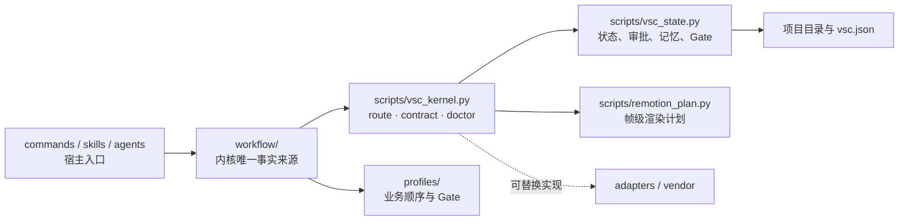

# 11 · v0.6 架构重构：从分散声明到可验证内核

日期：2026-10-02。

## 问题与根因

此前的物理目录按 `commands/`、`skills/`、`agents/`、`scripts/`、`profiles/` 划分，但跨目录共享的事实没有归属：同一个角色和阶段被重复写在总编排 Skill、Agent Markdown、状态机常量与 README 中。于是发生了“入口说可以交给某角色，仓库却没有该角色”的情况；也让使用者必须记住改编、连续性、声音和 Remotion 各用哪一个校验脚本。

这不是单纯缺文件，而是没有深模块：接口没有隐藏实现复杂度，相关修改也无法局部完成。

## 已采纳的结构



- `workflow/kernel.json`：阶段、命令、Skill、角色、Profile 阶段覆盖、跨模块契约和 Vendor Skill 路由。
- `workflow/roles.json`：12 个可发现角色的唯一角色卡；包括此前只存在于状态机的总编排器。不存在文件的三个旧角色名不再路由。
- `workflow/contracts.json`：6 个版本化格式的模板与校验器接口。
- `scripts/vsc_kernel.py`：稳定的 `route`、`contract validate` 与 `doctor` 接口；底层状态机或 Remotion 实现可以演进而不让调用者重学命令。
- `vendor/sources.lock.json`：第三方的机器可读真相；`vendor/THIRD_PARTY.md` 从它生成，而非在仓库根目录手工复制列表。

## 扩展规则

新增能力时按此顺序：先定义角色/契约，再在 `kernel.json` 建立阶段；新增对应 command、Skill、Agent、模板或实现；最后运行：

```bash
python3 scripts/vsc_kernel.py doctor
```

`doctor` 会检查每个命令、Skill、Agent、Profile 阶段、模板与校验器是否真的存在并对齐。这使“改一个地方、检查整个接缝”成为高杠杆操作，同时保持业务 Profile 和供应商适配器可替换。

## 保持的边界

这次重构没有伪造尚不存在的图像、视频、语音供应商接入、队列、成本账本、自动连续性检测或模型训练。它只建立了这些实现未来应接入的接缝；创作批准与权属判断仍由项目责任人承担。
