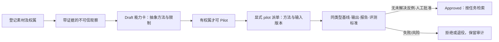

# 命令行使用

以下流程直接调用 VSC CLI；在 AI 客户端中使用时，智能体也按这些命令推进。

## 立即开始

VSC 的状态机只依赖 Python 标准库：

```bash
# 先确认每一个命令、Skill、角色、Profile、模板和校验器都真实存在
python3 scripts/vsc_kernel.py doctor

# 查看可选业务 Profile
python3 scripts/vsc_state.py profile list

# 新建一个小说连续短剧项目
python3 scripts/vsc_state.py init ./projects/雨夜来信 \
  --title "雨夜来信" \
  --profile vsc.novel-serial \
  --owner "导演"

# 查看下一关缺什么
python3 scripts/vsc_state.py status ./projects/雨夜来信
python3 scripts/vsc_state.py next ./projects/雨夜来信

# 登记小说或其他来源；脚本只记录路径与 SHA，不复制原文
python3 scripts/vsc_state.py source add ./projects/雨夜来信 \
  --kind novel --file ./source/雨夜来信.txt

# init 已生成 00-委托/创作委托.json；先填写观众、体验、目标顺序、
# 不可牺牲的约束、冲突裁决与责任人。模板占位内容不能批准。
python3 scripts/vsc_state.py artifact add ./projects/雨夜来信 \
  --type vsc.creative_brief --stage brief \
  --file ./projects/雨夜来信/00-委托/创作委托.json
python3 scripts/vsc_state.py artifact decide ./projects/雨夜来信 A-0001 \
  --status approved --by "导演"

# brief 通过后，继续完成来源、改编等前置产物
python3 scripts/vsc_state.py gate check ./projects/雨夜来信 brief
python3 scripts/vsc_state.py next ./projects/雨夜来信
```

`vsc.json` 是项目的状态权威，schema 为 3。登记产物时将源文件保存到 `09-台账/产物/` 的独立版本目录；修改工作文件不会改变已批准快照。修改／删除快照、拒绝或替代上游版本会使下游检查失败。返工用新产物与 `--supersedes`，不要编辑批准快照。默认 Profile 要求显式依赖前一阶段全部基线；连续短剧从剧本起按 `--scope EP-ID` 分集验收。具体编号以命令输出为准。

脚本不会替你调用生成模型、支付费用、发布内容或作出创作批准。状态锁适用于本机项目 CLI；其他工具应调用 CLI，不应直接覆写 `vsc.json`。

## 剧本化、连续性与声音

短剧不是“把小说喂给模型，再把 6 秒视频拼起来”。VSC 要求先把小说映射为集钩子和场景单元：每场都有来源、可见行动、人物目标、阻力、转折和观众新增信息；再把每段生成视频写成有入点和出点的镜头单元。

```text
小说来源 → 改编映射 → 场景剧本 → 资产/镜头 → 连续性计划 → 候选片段 → 声音提示表 → 时间线
```

```bash
# 阻止“有梗概、没有可拍场景”的改编假完成
python3 scripts/vsc_kernel.py contract validate vsc.adaptation-map/v1 ./projects/雨夜来信/02-改编/改编映射.json

# 阻止前一段出点与后一段入点在动作、服装、方向、场景等关键字段上自相矛盾
python3 scripts/vsc_kernel.py contract validate vsc.continuity-plan/v1 ./projects/雨夜来信/05-预演/连续性计划.json

# 检查 BGM/环境底的跨镜覆盖和 J/L cut、crossfade 等声音桥参数
python3 scripts/vsc_kernel.py contract validate vsc.sound-cue-sheet/v1 ./projects/雨夜来信/07-后期/声音提示表.json
```

可从 [改编映射模板](../../templates/adaptation-map.json)、[连续性计划模板](../../templates/continuity-plan.json) 和 [声音提示表模板](../../templates/sound-cue-sheet.json) 复制开始。每段 AI 视频都需绑定角色/场景参考资产、入点状态、出点状态及剪辑手柄。BGM、环境底、对白和音效则按场景与情绪弧线跨镜铺在时间线上；它们不会随每个 6–8 秒片段重新开始。完整方法、JSON 协议和公开资料依据见 [生产连续性与声音](../design/continuity-and-sound.md)。

统一契约命令检查文件结构，不自动知道它属于哪个项目。使用 `adaptation|continuity|sound validate FILE --project PROJECT` 可额外核对对象引用；批准与 Gate 会自动执行项目检查。先用 `object add` 登记集、场、sequence、镜头、take 与参考资产；它们使用不同且唯一的 ID。资产必须绑定有效已批准版本，不能仅写一个不存在的角色名。

交付还需实际成片的 `vsc.media-qa/v1` 技术报告，以及 `vsc.sample-review/v1` 人工审片记录。审片覆盖剧情动机、物理连续性、情绪连续性、剪辑覆盖、对白与音乐，并记录耗时、成本和失败。详见 [专业制作证据链](../governance/production-evidence.md)。

## 角色记忆、上下文与学习能力

每个 VSC 角色都有固定的身份、工作人格、权限与记忆边界。例如故事分析师证据优先、导演避免无目的炫技、生成制作人严格区分候选与成片。它们只在 [`workflow/roles.json`](../../workflow/roles.json) 中定义，`agents/` 是角色正文，各宿主入口由它生成；角色定义**不能**被素材、角色台词或当前对话自动重写。

子角色不接收主智能体的整段聊天记录，而接收可审计的任务上下文包：有效已批准产物、按任务相关性和字符预算选出的记忆／方法，以及会话摘要。摘要保存于任务包文件，但不写入 `vsc.json` 或长期记忆，也不自动清理；这不是真正的“只在内存中临时存在”。当前检索采用词汇与领域匹配，不是向量语义检索。

```bash
# 先把人审过的项目经验登记为 draft，再批准
python3 scripts/vsc_state.py memory add ./projects/雨夜来信 \
  --scope role --role director --kind lesson --source A-0003 \
  --content "反转前先给观众一个可误读的视觉线索。"
python3 scripts/vsc_state.py memory decide ./projects/雨夜来信 M-0001 \
  --status approved --by "导演"

# 为子角色生成最小上下文；parent-brief 不写入长期状态
python3 scripts/vsc_state.py context build ./projects/雨夜来信 \
  --role director --task "编排第 1 集雨夜追逐" --artifact A-0003 \
  --parent-brief "用户确认节奏要紧张，但不使用血腥表现。"
```

“从视频、图片或文本学习武术、打斗、特效、布局、情绪、对白或声音”在 VSC 中是一个受控闭环，而非让系统照搬素材或自行训练：



```bash
# owned/licensed 才可能晋升；unknown / analysis_only 只能停留在研究观察
python3 scripts/vsc_state.py source add ./projects/雨夜来信 \
  --kind video --file ./references/动作样片.mp4 --rights owned
python3 scripts/vsc_state.py learn observe ./projects/雨夜来信 \
  --kind action --source S-0002 --file ./notes/动作五拍.md \
  --content "将起势、交手、受击、停顿、反转分成五拍，并检查方向线。"
python3 scripts/vsc_state.py capability propose ./projects/雨夜来信 \
  --name "五拍动作节奏" --kind action --observation O-0001 --role director \
  --method "按五拍拆镜头，为每拍标注方向线和情绪转折。" \
  --limits "仅用于有授权项目；不复制人物、声音、特定作品或受保护风格。"
python3 scripts/vsc_state.py capability decide ./projects/雨夜来信 C-0001 \
  --status pilot --by "导演"

# 显式试用，不把 pilot 自动送进普通任务；A-0003 应是有效已批准输入
python3 scripts/vsc_state.py context build ./projects/雨夜来信 \
  --role director --task "比较五拍方法对动作方向的帮助" \
  --artifact A-0003 --pilot C-0001 --budget-chars 12000
```

评测需绑定 `--context`、`--output`、`--baseline`、`--evidence` 与 `--criteria`；输出依赖试用输入，报告依赖输出和同类型、同范围的比较基线。一次 pass 后出现 fail 会阻断晋升；只有同方法、同输入、同基线、同标准的明确重测 `--resolves EV-ID` 才能解决对应失败。单次通过只满足程序条件，不证明专业效果或泛化能力。

`capability export/import` 可跨项目传递人工去项目化的方法，不能夹带观察、项目事实、记忆和评测字段。导入后是 draft，需本项目复核和重新试用；不会继承其他项目的批准。能力卡不会自动变成 LoRA／微调、声音克隆或供应商调用。

旧 schema 1/2 项目需显式迁移；先备份原状态，旧产物与旧能力降为 draft，保留历史但不能当作新规则下有效批准。schema 1 未声明权属的来源补为 `unknown`。当前 Profile 与历史版本不同且无法恢复时，脚本会停止，只有负责人确认后才能加 `--accept-current-profile`：

```bash
python3 scripts/vsc_state.py migrate ./projects/雨夜来信
```

## 可扩展 Profile

`python3 -B scripts/vsc_state.py profile list` 列出各 Profile 的用途，`profile show <id>` 列出各阶段的必需产物（即质量门）。

复制 `profiles/` 中的 JSON 即可定制阶段、必需产物与规则。项目固定使用创建／迁移时的完整 Profile 快照，插件更新不静默改变既有项目。`dependency_policy: previous_stage` 要求前一阶段基线；`explicit` 只核对已声明依赖，不能检测漏声明。`scope_required_from` 控制从哪个阶段逐集验收。请保持 `vsc.*` 类型语义稳定。

## 外部来源与插件边界

VSC 接受小说、原创文本、品牌资料、素材库或 `creative-handoff/v1` JSON 清单。交接包只包含来源身份、允许范围、版本化来源产物和既有决定；导入后仍要在 VSC 中重新形成并批准本项目的 StoryMap、改编方案、剧本和镜头资产。

这使来源工具与 VSC 保持独立：不会互相调用、不会共享内部状态、不会要求在同一目录安装。协议详情见 [外部来源与交接](../../skills/vsc/references/source-handoff.md)。
