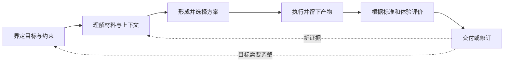

# 思想基础与跨行业研究

研究日期：2026-10-01。本文先说明公开思想与流程，再给出 VSC 的设计推论。哲学部分主要参考学术百科与经典文本；工程部分优先使用标准、官方文档和方法提出者的机构资料。完整索引见 [来源与证据边界](sources.md)。

## 1. 研究方式与边界

“所有公开哲学和所有工作流”没有一个可穷尽、可验证的清单。本轮采用代表性取样，选择标准是：能否回答创作系统中的实际问题；是否有可查证的公开出处；是否能导出明确机制；是否能说明失效边界。

研究分四组：哲学与认识论、跨行业生产与改进方法、影视视听制作、公开 AI 创作工具。它们的证据性质不同：哲学提供解释和价值选择，流程资料提供组织方法，产品文档说明产品公开表达的功能。产品文档不等于独立的效果测评。

本文使用三种表述：

- **来源观点**：资料实际讨论的内容，附直接来源。
- **设计推论**：我们把观点转化为 VSC 机制的判断，不归于原作者。
- **待验证假设**：是否改善成本、质量、效率或观众体验，需要试片检验。

通用性也分三个范围：跨行业可以复用的工作协议；创作领域共有的故事与视听语义；特定业务的风格与流程。不能因为一个连续短剧模板有效，就宣称它适用于所有创作。

## 2. 哲学首先帮助我们提出哪些问题

| 维度 | 通俗问题 | VSC 需要作出的选择 |
| --- | --- | --- |
| 本体论 | 我们究竟在处理什么？ | 区分故事世界、创作意图、资产、镜头、生成候选和最终作品 |
| 认识论 | 我们凭什么相信这个理解？ | 区分原文证据、推断、改编和模型补写 |
| 价值论 | 怎样的作品值得做？ | 明确表达、受众、商业目标、审美与权利边界 |
| 方法论 | 怎样在不确定中行动？ | 提出方案、做低成本样片、评价、修订 |
| 美学与解释 | 观众如何形成意义和感受？ | 检查人物行动、视点、声音、节奏和上下文 |
| 实践与治理 | 谁决定？如何承担后果？ | 规定决策责任、自动化范围、停止条件和追溯方式 |

这些是本项目的组织维度，不是某一哲学学派的完整分类法。

## 3. 代表性思想：可借鉴的部分与边界

下表“转化”一栏全部是 VSC 设计推论。不同思想并非可以无冲突合并，也不意味着原作者已经提出了工作流软件设计。

| 思想视角 | 来源观点的简要归纳 | 转化为 VSC 的机制 | 不应作出的推论 |
| --- | --- | --- | --- |
| 亚里士多德的四因解释 | 从材料、形式、作用来源和目的等方面解释事物。[来源](https://plato.stanford.edu/entries/aristotle-causality/) | 创作委托同时写明素材、作品形式、制作能力和目的 | 不能据此证明任何固定软件分层天然正确 |
| 实用主义 | 认识与行动、经验后果及探究相联系，内部存在多种解释。[来源](https://plato.stanford.edu/entries/pragmatism/) | 把创作策略写成可试验的假设，用试片修订 | 不等于“播放量高就是真理” |
| 解释学 | 理解受语境、历史和解释者立场影响，整体与部分相互说明。[来源](https://plato.stanford.edu/entries/hermeneutics/) | 章节分析与全书人物弧交叉核验，保留解释分歧 | 逐章摘要拼起来不必然等于理解全书 |
| 现象学 | 关注第一人称经验及其结构。[来源](https://plato.stanford.edu/entries/phenomenology/) | 为每一叙事段标记观众此刻看见、知道、期待、感受什么 | 不能从一张自动打分表还原所有体验 |
| 皮尔士符号学 | 意义涉及符号、对象与解释的关系。[来源](https://plato.stanford.edu/entries/peirce-semiotics/) | 把“画面里有什么”与“它传达什么”分开存储 | 同一画面或音效并不对所有受众产生相同含义 |
| 黑格尔辩证法 | 概念的发展涉及内部限制、对立和转化；不能机械套用三段公式。[来源](https://plato.stanford.edu/entries/hegel-dialectics/) | 记录忠实与压缩、自由与一致性等冲突，并给出取舍理由 | 不把所有剧情强塞进“正—反—合” |
| 批判理性主义 | 对知识保持可批判性，让假设面对可能否定它的检验。[来源](https://plato.stanford.edu/entries/popper/) | 在试片前写出“什么结果会让我们放弃此方案” | 艺术价值不是单一可证伪命题 |
| 有限理性 | 决策受信息和计算资源限制，可以按满意条件选择方案。[来源](https://plato.stanford.edu/entries/bounded-rationality/) | 给候选数、重试数、审片时间和预算设界，满足条件后结束 | 不把“勉强能用”当作所有项目的质量标准 |
| 庄子的多视角与实践问题 | 对固定判断、语言区分和不同生活实践保持反思。[来源](https://plato.stanford.edu/entries/zhuangzi/) | 允许不同创作流派和风格模板并存，允许有理由的例外 | 不能把“无为”直接等同于全自动执行，也不能把留白说成唯一中国美学 |
| 佛教思想中的无常与条件性视角 | 相关传统讨论变化、自我与苦的成因，且不同诠释有分歧。[来源](https://plato.stanford.edu/entries/buddha/) | 提醒设计者把判断和设定视为有条件、可修订的版本 | 宗教哲学不是软件依赖图或故障分析的技术证明 |
| 义务伦理与德性伦理 | 前者关注行动的义务和约束，后者重视品格、实践判断等问题。[义务伦理](https://plato.stanford.edu/entries/ethics-deontological/)／[德性伦理](https://plato.stanford.edu/entries/ethics-virtue/) | 把可用素材范围和责任人显式化，把创作判断保留给有相应职责的主体 | 高效率不能自动抵消其他边界；也不能把伦理化约为勾选清单 |
| 批判理论 | 反思支配关系、工具理性和文化生产。[来源](https://plato.stanford.edu/entries/critical-theory/) | 审查单一流量目标是否挤压表达、多样性和创作者自主权 | 不因此预设商业作品一定没有价值 |

另有两组跨学科思想特别适合连接哲学与工程：

- **系统思维**：Meadows 讨论系统目标、规则、反馈和范式等不同干预位置。VSC 的推论是，先检查目标与规则，再判断是否仅需调参数。[来源](https://donellameadows.org/archives/leverage-points-places-to-intervene-in-a-system/)
- **控制论**：Ashby 讨论调节能力与扰动多样性。VSC 的推论是，系统需要多种失败分类和恢复路径；一个统一的“重新生成”按钮不足以处理所有问题。[来源，第 11 章](https://ashby.info/Ashby-Introduction-to-Cybernetics.pdf)

以上是适用问题的取样，不是哲学史全景。理性主义、经验主义、儒学、马克思主义、存在主义、分析哲学等体系仍有大量未展开的内容；未来应围绕具体设计争议继续扩展，避免只增加流派名称。

## 4. 哪些分歧需要保留

### 4.1 原作忠实与媒介重构

解释学提醒我们理解上下文；制作约束要求压缩、合并或外化。这两者可以冲突。VSC 应建立“改编契约”：哪些事件因果、人物动机和主题不得改变，哪些人物、场景、顺序和对白可以调整。

例如，把长篇内心独白改成一次迟疑的动作，可能保留了人物意图；为了刺激而把自愿帮助改成受威胁帮助，却可能改变核心人物关系。是否接受应由改编目标判断，并记录改变的依据。

### 4.2 可测量结果与审美经验

观看完成率、制作成本、交付速度都可以测量；悲伤是否有余韵、人物是否复杂、画面是否有作者性，无法完全压成同一个分数。

VSC 的评价应保留多个维度和评语。在可比较条件下选择方案，同时允许创作者有理由地选择商业预测稍低、表达更完整的版本。业务模板必须提前说明优先级。

### 4.3 标准化与创作自由

接口、时码、资产身份和责任关系适合统一；节奏、风格、叙事顺序与运镜不应强制统一。技术连续性也允许被创作意图主动打破，但应说明这是有意设计，避免与意外穿帮混淆。

### 4.4 学习循环与及时交付

不断试验能够发现新方案，也可能导致无限返工。需要在开始时约定预算、候选数、最低可接受条件与截止点。想要继续探索时建立新任务和新预算，不悄悄改变原任务范围。

## 5. 从其他行业学习流程

| 行业／方法 | 公开资料支持的特点 | VSC 可复用的机制 | 迁移边界 |
| --- | --- | --- | --- |
| 设计：双钻 | 发现、定义、发展、交付，包含发散与收敛。[Design Council](https://www.designcouncil.org.uk/resources/the-double-diamond/) | 先明确创作问题，再比较方向；剧本和视觉都允许多方案 | 不是只许经过一次的四个关卡 |
| 质量改进：PDSA | 从理论和计划出发，执行、研究结果、调整。[Deming Institute](https://deming.org/explore/pdsa/) | 每次试片记录假设、结果和改变；不只打合格勾 | PDSA 的 Study 不应被简化成只做检查 |
| 精益制造 | 从客户价值、价值流、流动和拉动改善生产。[Lean Enterprise Institute](https://www.lean.org/lexicon-terms/lean-thinking-and-practice/) | 下游真正需要某镜头时再大量制作，限制在制品 | 创意探索本身可能有价值，不能都算浪费 |
| 约束理论 | 系统整体表现受到约束限制，局部优化不等于整体改善。[Goldratt Research Labs](https://www.goldrattresearchlabs.com/introduction-to-toc) | 统计等待、返工与可用素材，优先解决当前瓶颈 | 瓶颈会变化，不能永久认定视频生成最慢 |
| 软件敏捷 | 小步交付、协作与根据反馈调整。[敏捷原则](https://agilemanifesto.org/principles.html) | 先做可看样片，保持模板和工具可替换 | 不能用频繁改变抵消已经发生的制作成本 |
| 系统工程 | 分别检查是否满足要求和是否满足实际使用需要。[NASA Verification](https://www.nasa.gov/reference/5-3-product-verification/)／[Validation](https://www.nasa.gov/reference/5-4-product-validation/) | 分开做媒体技术验收与观众理解验证 | 不复制航天项目的全部管理负担 |
| 企业流程：BPMN | 提供活动、事件、分支等流程表达和交换标准。[OMG](https://www.omg.org/spec/BPMN/2.0.2/) | 明确等待、并行、分支、人工作业和异常 | BPMN 图不能替代故事、镜头和资产语义 |
| 长任务执行 | 工作流重放与外部活动分离，活动需考虑幂等。[Temporal](https://docs.temporal.io/activity-definition) | 长时间生成、重启恢复、结果认领与去重 | 执行可恢复不等于外部供应商永不重复收费 |
| 数据溯源 | 描述实体、活动与参与主体之间的来源关系。[W3C PROV](https://www.w3.org/TR/prov-overview/) | 从最终镜头回查参考图、剧本依据、工具版本与审片决定 | 有溯源记录不等于内容事实自动正确 |
| 影视／动画制作 | 连续性、分镜预演、版本和交付清单都有专门职责。[ScreenSkills](https://www.screenskills.com/skills-checklists/scripted-film-and-tv/script-supervisor-department/script-supervisor-skills/)／[Netflix](https://partnerhelp.netflixstudios.com/hc/en-us/articles/4409337964819-Feature-Animation-at-Netflix-FAN-CSV-Manifest-Requirements) | 制作圣经、场记状态、候选镜头、版本评审、明确交接 | 人的职业分工不必一对一变成软件服务或 AI 代理 |
| 3D 与剪辑交换 | USD 支持场景组合；OTIO 表达剪辑结构并外部引用媒体。[USD](https://openusd.org/release/intro.html)／[OTIO](https://opentimelineio.readthedocs.io/en/latest/) | 资产可复用、镜头有版本、时间线可导出 | USD 不负责小说理解，OTIO 也不是音视频渲染器 |

这里归纳的是功能上的相似性，不表示这些行业使用同一种理论，也不是量化证明。

## 6. 公开 AI 创作工作流给出的信号

以下只比较已查证的公开流程与接口表达，不做效果排名，也不保证某项功能在所有地区、套餐和 API 中都可用。

| 公开样本 | 可确认的公开设计 | 对 VSC 的启发 | 仍需实测的部分 |
| --- | --- | --- | --- |
| ComfyUI | 节点和连接构成工作流；官方有图生视频、首尾帧等示例。[概念](https://docs.comfy.org/basic-concepts/workflow)／[Wan 示例](https://docs.comfy.org/tutorials/video/wan/wan2_2) | 作为生成子流程适配器，保存工作流和依赖版本 | 节点兼容性、硬件、稳定性、素材合格率 |
| LTX Studio Flows | 官方介绍连接文本、图像、视频、音频等节点，以及变更节点的缓存处理。[官方教程](https://ltx.io/blog/ltx-studio-flows) | 创作资产和局部重算值得作为核心机制 | 缓存是否理解叙事语义；具体导出与 API 能力 |
| Runway 图生视频 | 输入图像约束构图等视觉信息，文本重点描述主体、环境和相机运动。[官方指南](https://help.runwayml.com/hc/en-us/articles/48324313115155-Image-to-Video-Prompting-Guide) | 把图像规格与运动规格分开，再按模型能力编译 | 精确动作、多人关系、跨镜头连续性 |
| Google Flow | 公开介绍可复用素材、相机控制和场景组织工具。[产品介绍](https://blog.google/innovation-and-ai/products/google-flow-veo-ai-filmmaking-tool/) | 项目级资产和镜头组合应独立于单次生成 | 产品宣传中的一致性是否满足具体作品 |
| Seedance 参考生成 | 官方检索内容描述图像、视频和音频参考及编辑／延展路径。[官方指南](https://docs.byteplus.com/en/docs/modelark/seedance-2-0-prompt-guide?redirect=1) | 不同参考素材要有明确角色和用途 | 此页正文抓取不完整，具体接口限制需要接入前核查 |
| ElevenLabs Voice Design | 官方文档将声线描述、口音、语速、预览文本等作为声音设计要素。[官方文档](https://elevenlabs.io/docs/eleven-creative/voices/voice-design) | 声音身份与单句表演分开管理，先试听再使用 | 中文细微情绪、长篇一致性、可用权限与成本 |

**研究判断：**公开产品已经覆盖从生成节点到项目素材与镜头组织的多个层面。因此，VSC 的核心设计应聚焦可共享的创作语义、跨阶段决策和可恢复的生产过程。仅有节点连线不足以表达“这次改编为什么成立”。

这也不意味着现有产品都没有这些能力；本轮没有做完整功能审计或竞品试用。

## 7. 共性：目标、依据、选择、产物、判断、修订

综合上述资料，本提案提取一个最小工作闭环：

这个闭环可以发生在整部剧、一集、一个镜头或一句对白中；粒度可以变化，责任和输入输出需要明确。

VSC 通用内核应该承载闭环中的角色和记录，不应强制所有业务采用同一种阶段顺序。例如，音乐短片可能从音乐出发，小说短剧从故事出发，品牌内容从产品信息与受众出发。

## 8. VSC 的十条设计原则

这些原则是本研究提出的项目约定，后续可被实践修订。

| 原则 | 需要的机制 | 怎样发现它没有落实 |
| --- | --- | --- |
| 目的先行 | 每个项目、场景和关键镜头有目的 | 只有“好看、震撼”等形容词，没有叙事功能 |
| 依据可追溯 | 原文定位、解释标签、改编记录 | 无法回答某条人物设定从哪里来 |
| 语义先于工具 | 领域规格独立于模型提示词 | 换模型就要重写全部剧本和镜头定义 |
| 多方案后收敛 | 有限候选、比较依据、选择记录 | 要么第一稿即定稿，要么永远没有定稿 |
| 尽早验证体验 | 带声音的预演与试读 | 正式生成后才发现对白和动作放不进时长 |
| 整体优先 | 以可用片段和完整作品评价局部产出 | 单镜头优秀但无法连贯剪辑 |
| 版本与依赖明确 | 固定版本引用、影响分析 | 改角色声线时误删重做所有画面 |
| 自动化有边界 | 策略明确授权、预算与例外处理 | 模型自行扩大任务或无限重试 |
| 责任可辨认 | 关键决定有主体、范围和理由 | “AI 说可以”成为唯一放行理由 |
| 反馈能改变方法 | 记录假设、结果和下一轮规则 | 发布后只有数据报表，没有方法更新 |

## 9. 待验证的主要假设

H1：在正式生成前审看带声音的分镜预演，可以减少后期叙事返工。

H2：角色、场景和连续性采用版本化共同资产，可以减少跨镜头不一致。

H3：按依赖关系定位返工，能降低单次修改的成本和等待时间。

H4：语义规格与模型适配分离，能降低替换模型的迁移成本。

H5：以同一内核支持至少两种明显不同的业务模板，可以提供初步通用性证据。

这些是实验问题，不是已经获得的数据结论。验证方法见 [Profile 与验证](../design/profiles-and-validation.md)。
